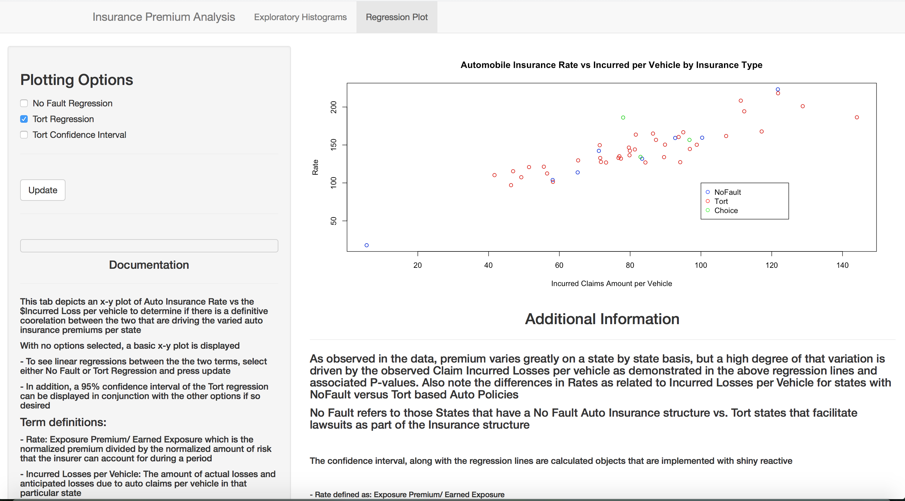

## Introduction

People often complain that automobile insurance is wildly expensive in their state...

Part of this is perception but a portion is rooted in actual premium rates differences.  We are all aware that the rates do vary based upon a person's demographics, driving record and even the type of car they are driving.  Putting these aside though, we are going to explore:

* Are there fundamental baseline differences in the rate structures across the states?
* What is driving these rate differences?

---

## Varying Auto Insurance Premiums Across States

#### Some Basic Statistics


```{r echo= FALSE, fig.width= 13, fig.height= 4}
library(ggplot2)
library(gridExtra)

tort <- read.csv("./Tort-No Fault.csv", header= TRUE)
avgPrem <- read.csv("./Combined Avg Premium.csv")
combined <- merge( avgPrem, tort )

whisker <- ggplot(combined, aes(NoFault, X2012, fill= NoFault)) + geom_boxplot() +
 ylab("Avg. Premium") +
 ggtitle("Average Premiums by Policy Type( Nofault, Tort, Choice )" )

##histplot <- qplot(combined$X2012,
##      geom="histogram",
##      binwidth = 0.5,  
##      main = "Histogram for Premium", 
##      xlab = "Auto Premium", 
##      fill=I("blue"), 
 ##     col=I("red"))

histplot <- ggplot(data=combined, aes(combined$X2012)) + 
  geom_histogram(breaks=seq(500, 1400, by = 100), 
                 col="red", 
                 aes(fill=..count..)) +
  labs(title="Histogram for Auto Insurance Premium Across States") +
  labs(x="Auto Premium in Dollars", y="Count of States") 
  
  ##xlim(c(18,52)) + 
  ##ylim(c(0,30))
   


#histplot
plot_grid(whisker, histplot,ncol= 2, nrow= 1)

```

* The type of policy whether NoFault, Choice or Tort(Not NoFault) has some effect in the spread of Premiums.


* But, the distribution of auto premiums are more than likely being driven by other factors given the individual spreads within Policy type.

> We really need to explore the data further...


---

## Are There Relevant Factors That are Driving the Varying Premiums or are Insurers Price Gouging Across Different States ?

#### Many factors can be driving auto premium differences such as:

* Driver Demographics/Type of Car
* Points on License
* Historical Accidents
* Theft/Larceny Associated with the geographical area
* Miles driven
* Urban/Suburban/Rural attributing factors
* Others...

#### To analyze these factors is a larger effort than afforded here, but can we find a factor(s) that proves or disproves the price gouging hypothesis and if so against what outcome ?


---

##  Use the Insurance Premium Analysis App to Explore and Correlate between Rate and Underlying Factors

```{r, echo= FALSE, out.width = 600, fig.retina = NULL}

```

##### Hint: Are the amount of claims generated on a state by state basis a signigicant factor to Premium pricing/rates ?

[To visit the Insurance Premium Analysis App, follow this URL link]( https://trivea.shinyapps.io/InsuranceShiny/ "Data Products")

#### Thank you
